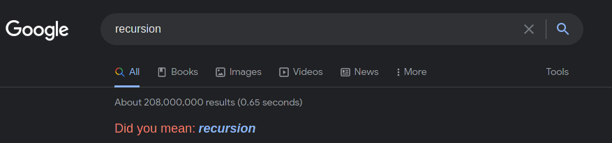

author: fudonglai, AngelKitty, labuladong

Last translated with upstream [08eb0c5](https://github.com/OI-wiki/OI-wiki/commit/08eb0c53b1ad55b518b0f5f7a569c25b8c1215b2#diff-f6f59ea091666854504b33243563a98ec55edf8f4c6a26dec1b2726479de41b4)

The article will introduce difference between recursive algorithm and divide-and-conquer algorithm, and how could they be used together.

## Introduction

In computer science and math, recursion is method by using functions that call themselves from within their own definition. Additionally in computer science it also refers to a method of solving problem by repeatedly decomposing problem into sub-problems of the same type as the original.

From [Wikipedia](https://en.wikipedia.org/wiki/Divide-and-conquer_algorithm):
> In computer science, divide and conquer is an algorithm design paradigm. A divide-and-conquer algorithm recursively breaks down a problem into two or more sub-problems of the same or related type, until these become simple enough to be solved directly. The solutions to the sub-problems are then combined to give a solution to the original problem. 

## Detailed Introduction

### Recursion

> To understand recursion, you must first understand recursion.

The fundamental idea of recursion is a function calling itself directly or indirectly, so that the original problem transforms into many sub-problems with similar properties but smaller size. When solving problems, we only need to focus on how to decompose original problems to proper sub-problems, but not too much attention on how it is solved.

Here are some examples that may be helpful for understanding recursion:

1. [What is recursion?](./divide-and-conquer.md)
2. Q: How to sort a sequence of numbers? A: Decompose them into two halves. First sort left half and then right half, and finally merge them into one array. As for how to sort left and right halves, please read this example again.
3. Q: How old are you this year? A: My age in last year add one year, and I am born in 1999.
4. [Google's example to understand recursion](https://www.google.com/search?q=recursion) 

Recursion is very common in mathematics. For example, in set theory, we have the following definition of natural number[^ref1]: $1$ is a natural number, and every natural number has a successor which is also a natural number.

Recursive codes have two most important features: terminating case and recursive case<!---使用https://en.wikipedia.org/wiki/Recursion_(computer_science)#Recursive_functions_and_algorithms中的措辞-->. The job of recursive case is to solve sub-problems, while terminating case defines result of shortest sub-problem 

```cpp
int func(some_type input_value) {
  if (is_terminating_case) return result_of_shortest_sub_problem;
  return func(smaller_size);
}
```

#### Reasons to Write Recursion

1.  Code will be more readable with a more clear structure. E.g., different implementation of [merge sort](./merge-sort.md):

    ```cpp
    // C++ Version
    // Implementation without recursion
    template <typename T>
    void merge_sort(vector<T> a) {
      int n = a.size();
      for (int seg = 1; seg < n; seg = seg + seg)
        for (int start = 0; start < n - seg; start += seg + seg)
          merge(a, start, start + seg - 1, std::min(start + seg + seg - 1, n - 1));
    }

    // Implementation with recursion
    template <typename T>
    void merge_sort(vector<T> a,3int front, int end) {
      if (front >= end) return;
      int mid = front + (end - front) / 2;
      merge_sort(a, front, mid);
      merge_sort(a, mid + 1, end);
      merge(a, front, mid, end);
    }
    ```

    ```python
    # Python Version
    # Implementation without recursion
    def merge_sort(a):
      n = len(a)
      seg, start = 1, 0
      while seg < n:
          while start < n - seg:
              merge(a, start, start + seg - 1, min(start + seg + seg - 1, n - 1))
              start = start + seg + seg
          seg = seg + seg
      
    #Implementation with recursion
    def merge_sort(a, front, end):
      if front >= end:
          return
      mid = front + (end - front) / 2
      merge_sort(a, front, mid)
      merge_sort(a, mid + 1, end)
      merge(a, front, mid, end)
    ```

    Obviously, the recursive code is easier to understand than the non-recursive version, being clear at a glance: sort left half first and then right half then finally merge two halves into one. However, the non-recursive version is unintelligible, full of incomprehensible details of edge computing and hard to debug.

2. Learning how to analyze the structure of problem by exercising. If you are familiar with coding recursive programs, you will sharply find out the feature that a problem can be discomposed into similar sub-problem, and then solve it efficiently.

#### Disadvantages of Recursion

During executing programs, recursions are implemented by call stack. Every function calling will add a frame in the stack, and every return will do the opposite. However the size of call stack is not infinite. Too many of recursions will lead to the consequence of stack overflow.

Obviously sometimes recursion is efficient, such as merge sort. But **sometimes it is inefficient**, such as counting hairs of Sun Wukong[^ref2]. Call stack will consume extra space, while simple iteration won't. For the example problem: You are given a head of link table, and you are asked to calculate the length of the link table. Here are two different implementations: 

```cpp
// Typical iteration implementation
int size(Node *head) {
  int size = 0;
  for (Node *p = head; p != nullptr; p = p->next) size++;
  return size;
}

// ... or recursion implementation
int size_recursion(Node *head) {
  if (head == nullptr) return 0;
  return size_recursion(head->next) + 1;
}
```

](images/divide-and-conquer-2.png "[Comparison between two implementation (with clang 10.0 and O1 optimization).](https://quick-bench.com/q/rZ7jWPmSdltparOO5ndLgmS9BVc)")

#### Optimization of Recursion

Main articles: [Optimization of searching](../search/opt.md) and [Memorized searching](../dp/memo.md)

Straightforward recursion implementations may have too many recursions, which may lead to timeouts. This is when recursion implementations need to be optimized. [^ref3]

### Divide and Conquer

Divide and Conquer is an algorithm design paradigm. Process of algorithms based on it can be divided into three parts executed in sequence: divide, conquer, and combine.

1. Divide: Decompose original problem into two or more similar sub-problems.
2. Conquer: After decomposing problems into some easily solvable bound, solve the sub-problem recursively until solved.
3. Combine: Combine results from sub-problems to obtain the final result of original problem.

Generally, problems which can be solved with divide and conquer paradigm have these features:

- The problem can be easily solved when its size is small enough.
- The problem can be decomposed into several sub-problems with smaller size, i.e., the problem has the property of optimal substructure. Results of sub-problems decomposed from original problem can be used and combined into results of original problem.
- Sub-problems decomposed from original problem are independent to each other, i.e., Sub-problems do not contain common sub-problems between them.

???+warning "Warning"
    If sub-problems are not independent, then algorithms using divide-and-conquer paradigm need to solve common sub-problems repeatedly. Thus, unnecessary works would be done. Under such circumstances it is better to use [dynamic programming](../dp/basic.md) rather than divide-and-conquer paradigm.

Let take merge sort as an example. Assume we have a function named `merge_sort` as an implementation of merge sort. The job of this function is **to sort an input array**. The problem is obviously can be decomposed. Sorting an array is equivalent to sorting two halves of this array, then combine them to one.

```cpp
// This block of code has been simplified.
void merge_sort(type* an_array) {
  if (is_easy_to_process) return;
  merge_sort(left_half);
  merge_sort(right_half);
  merge(left_half, right_half);
}
```

If we call the function with half of the array, then after processing this half of array will become sorted. We can notice that `merge_sort` is similar to the template of post-order traversal of binary tree. Like the three parts of divide and conquer mentioned before, firstly decompose left and right, then process their combination. Combining is unstacking, which is equivalent to post-order traversal.

The implementation of function `merge` is same to implementation that combines two ordered linked lists into one.

## Key points

### Keys of Writing Recursion

**Understand a function's purpose and believe it can finish the job. DO NOT jump into the function for discovering more details,** or you will may be unable to get out of the infinite details, since human is not so good at maintaining a stack in mind.

E.g. traverse a binary tree:

```cpp
void traverse(TreeNode* root) {
  if (root == nullptr) return;
  traverse(root->left);
  traverse(root->right);
}
```

This block of code is enough to finish any binary tree. For the recursive function `traverse(root)`, you just need to believe that it can traverse the whole tree with one root node `root`. So, it only needs to pass the left and right sub-nodes of the node to the function again. 

The same code design can be extended for traversing any tree data structure. However, for the tree it is obviously that it doesn't have in-order traversal.

```cpp
void traverse(TreeNode* root) {
  if (root == nullptr) return;
  for (auto child : root->children) traverse(child);
}
```

## Difference

### Recursion versus Enumeration

The difference is, enumeration is decomposing the problem horizontally and solving them, while recursion is vertically by braking it down level-by-level.

### Recursion versus Divide and Conquer

Recursion is a coding skill, a thinking method to solve problem. Divide and conquer is a algorithm design paradigm solving detailed problem, mostly based on recursion.

## Example Problems

???+note "[437. Path Sum III](https://leetcode.com/problems/path-sum-iii/)" 
    Given the `root` of a binary tree and an integer `targetSum`, return the number of paths where the sum of the values along the path equals `targetSum`.

    The path does not need to start or end at the root or a leaf, but it must go downwards (i.e., traveling only from parent nodes to child nodes).
    
    Example 1: 
    
    ```text
    Input: root = [10,5,-3,3,2,null,11,3,-2,null,1], targetSum = 8
    
          10
         /  \
        5   -3
       / \    \
      3   2   11
     / \   \
    3  -2   1
    
    Output: 3
    Explanation: The paths that sum to 8 are shown.
    
    1.  5 -> 3
    2.  5 -> 2 -> 1
    3. -3 -> 11
    ```
    
    ```cpp
    /**
    * Definition for a binary tree node.
    * struct TreeNode {
    *     int val;
    *     TreeNode *left;
    *     TreeNode *right;
    *     TreeNode() : val(0), left(nullptr), right(nullptr) {}
    *     TreeNode(int x) : val(x), left(nullptr), right(nullptr) {}
    *     TreeNode(int x, TreeNode *left, TreeNode *right) : val(x), left(left), right(right) {}
    * };
    */
    ```

??? note "Example solution"
    ```cpp
    int pathSum(TreeNode *root, int sum) {
      if (root == nullptr) return 0;
      return count(root, sum) + pathSum(root->left, sum) +
             pathSum(root->right, sum);
    }
    
    int count(TreeNode *node, int sum) {
      if (node == nullptr) return 0;
      return (node->val == sum) + count(node->left, sum - node->val) +
             count(node->right, sum - node->val);
    }
    ```

??? note "Explanation"
    The problem itself seems to be complex, but the code is very simple.
    
    First of all, to recursively solve a problem of tree data structure, it is required to traverse the whole tree. So the template of tree traversal, which is separately recursively call the function with left and right sub-tree, should appear in the given main function `pathSum`. So, for each nodes, what should they do? They should count how many eligible path for itself and it's sub-tree. Then, the problem is solved.
    
    According to the skills mentioned before, we have a clear definition for the job of each recursive function based on the analysis.
    
    Function `pathSum`: Given a node and a target value. Return the number of paths whose the sum is target value in the tree rooted at this given node.
    
    Function `count`: Given a node and a target value. Return the number of paths with the node as the beginning of path, whose the sum is target value, in the tree rooted at this given node.
    
    ??? note "Example solution (with comments)"
        ```cpp
        int pathSum(TreeNode *root, int sum) {
          if (root == nullptr) return 0;
          int pathImLeading = count(root, sum);  // Paths with the node itself as beginning node.
          int leftPathSum = pathSum(root->left, sum);  // Total number of paths on the left. (Believe it can return expected results.)
          int rightPathSum =
              pathSum(root->right, sum);  // Total number of paths on the right. (Believe it can return expected results.)
          return leftPathSum + rightPathSum + pathImLeading;
        }
        int count(TreeNode *node, int sum) {
          if (node == nullptr) return 0;
          // Does this node itself be treated as an independent path?
          int isMe = (node->val == sum) ? 1 : 0;
          // How many paths on the left with the argument `sum` as `sum - node.val`?
          int leftNode = count(node->left, sum - node->val);
          // How many paths on the right with the argument `sum` as `sum - node.val`?
          int rightNode = count(node->right, sum - node->val);
          return isMe + leftNode + rightNode;  // Return the total number.
        }
        ```
    
    As we mentioned before: **Understand a function's purpose and believe it can finish the job.**
    
    In summary, the function `pathSum` offers a template of traversing a binary tree. While traversing it calls the function `count` on every node. The function `count` is also a traversal of binary tree. Its job is to find the path whose the sum is target value with the node itself as beginning.[^ref4]

## Exercise

- [LeetCode's Introduction to Algorithms Recursion I](https://leetcode.com/explore/learn/card/recursion-i/)
- [LeetCode's problems with the tag divide and conquer](https://leetcode.com/tag/divide-and-conquer/)

## References and Footnotes

[^ref1]: Assume natural numbers count from $1$.
[^ref2]: Sun Wukong is a character in Chinese mythology. As described in *Journey to the West* he has 84,000 recyclable hairs, which can be considered as countless. 
[^ref3]: [labuladong 的算法小抄 - 递归详解](https://labuladong.gitbook.io/algo/suan-fa-si-wei-xi-lie/di-gui-xiang-jie)
[^ref4]: This example uses pre-order traversal as implementation. In-order, post-order traversal will do the same.
