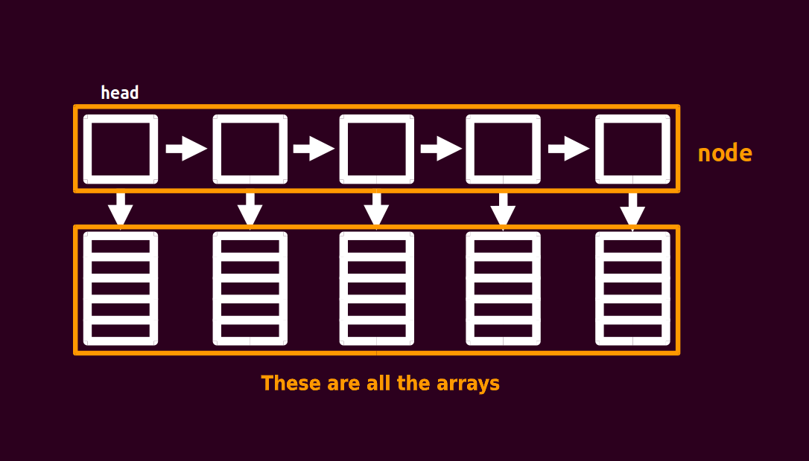

author: HeRaNO, konnyakuxzy

 [](./images/block_linked_list.png "./images/block_linked_list.png") 

It is not hard to find that the block linked list is a linked list, and each node points to an array.
We divide the original array of length n into $\sqrt{n}$ nodes, and the size of the array corresponding to each node is $\sqrt{n}$ .
So we define the structure as the code below shows.
Among them, `sqn` means `sqrt(n)` that is $\sqrt{n}$ , and `pb` means `push_back`, that is, adding an element to this `node`.

```cpp
struct node {
  node* nxt;
  int size;
  char d[(sqn << 1) + 5];
  node() { size = 0, nxt = NULL, memset(d, 0, sizeof(d)); }
  void pb(char c) { d[size++] = c; }
};
```

Block linked lists should at least support these operations: split, insert, and lookup.
What is split? It is to split a `node` into two small `nodes` to ensure that the size of each `node` is close to $\sqrt{n}$ (otherwise it may degenerate into an ordinary array). When the size of a `node` exceeds $2\times \sqrt{n}$ , the split operation is performed.

How to do the split operation? First create a new node, and then `copy` the last $\sqrt{n}$ values of the split node to the new node, and then delete the last $\sqrt{n}$ values of the split node (` size--` ), and finally insert the new node after the split node.

The time complexity of all operations of the block linked list is $\sqrt{n}$ .

There is one more thing worth mentioning here.

As elements are inserted (or deleted), $n$ will change, and $\sqrt{n}$ will also change. In this way, the size of the block will change. Do we have to maintain the size of the block every time?

In fact, this is not the case. we could just set $\sqrt{n}$ to a fixed value. For example, the range given by the title is $10^6$ , then $\sqrt{n}$ is set as a constant with a size of $10^3$ , so we don't need to change it.

```cpp
list<vector<char> > orz_list;
```

## Sample problem

[Big String POJ - 2887](http://poj.org/problem?id=2887)

Solution:
This is a very simple template problem. Code is shown as below:

```cpp
#include <cctype>
#include <cstdio>
#include <cstring>
using namespace std;
static const int sqn = 1e3;
struct node {
  node* nxt;
  int size;
  char d[(sqn << 1) + 5];
  node() { size = 0, nxt = NULL; }
  void pb(char c) { d[size++] = c; }
}* head = NULL;
char inits[(int)1e6 + 5];
int llen, q;
void readch(char& ch) {
  do
    ch = getchar();
  while (!isalpha(ch));
}
void check(node* p) {
  if (p->size >= (sqn << 1)) {
    node* q = new node;
    for (int i = sqn; i < p->size; i++) q->pb(p->d[i]);
    p->size = sqn, q->nxt = p->nxt, p->nxt = q;
  }
}
void insert(char c, int pos) {
  node* p = head;
  int tot, cnt;
  if (pos > llen++) {
    while (p->nxt != NULL) p = p->nxt;
    p->pb(c), check(p);
    return;
  }
  for (tot = head->size; p != NULL && tot < pos; p = p->nxt, tot += p->size)
    ;
  tot -= p->size, cnt = pos - tot - 1;
  for (int i = p->size - 1; i >= cnt; i--) p->d[i + 1] = p->d[i];
  p->d[cnt] = c, p->size++;
  check(p);
}
char query(int pos) {
  node* p;
  int tot, cnt;
  for (p = head, tot = head->size; p != NULL && tot < pos;
       p = p->nxt, tot += p->size)
    ;
  tot -= p->size;
  return p->d[pos - tot - 1];
}
int main() {
  scanf("%s %d", inits, &q), llen = strlen(inits);
  node* p = new node;
  head = p;
  for (int i = 0; i < llen; i++) {
    if (i % sqn == 0 && i) p->nxt = new node, p = p->nxt;
    p->pb(inits[i]);
  }
  char a;
  int k;
  while (q--) {
    readch(a);
    if (a == 'Q')
      scanf("%d", &k), printf("%c\n", query(k));
    else
      readch(a), scanf("%d", &k), insert(a, k);
  }
  return 0;
}
```
