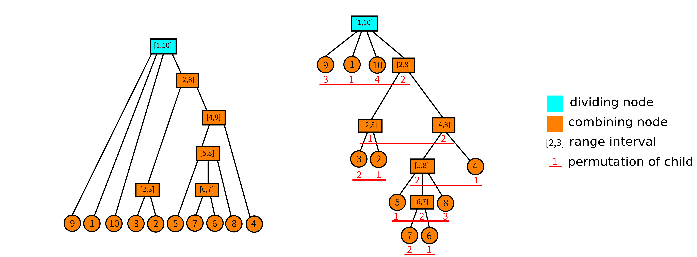

Some symbols we might be using in this article: $\wedge$ means logical AND, and $\vee$ means logical OR.

The **divide-combine tree** was invented by Cheng-ao Liu(Github@[CommonAnts](https://github.com/CommonAnts)). The original Chinese name is 析合树. The English name was defined by GitHub user [sshwy](https://github.com/sshwy).

## Problem about segments

We start by introducing a simple problem:

> For a permutation of $1-n$ , we call a continuous range of values a segment and try to get the number of segments in an permutation. For example, the segments of $\{5 ,3 ,4, 1 ,2\}$ are: $[1,1],[2,2],[3,3],[4,4],[5,5 ],[2,3],[4,5],[1,3],[2,5],[1,5]$ .

It seems that the time complexity of maintaining the range set of intervals seems quite unsatisfying. The segment tree can query whether a certain interval is a segment, but it is not able to count the number of segments.

Here we introduce this magical data structure - Divide-combine Tree!

## Continuous segment

Before introducing the divide-combine tree, we first define some preconditions. In view of the fact that the definition of LCA's course materials is not very clear, we will add some definitions for better understanding.

### Permutation and continuous segment

 **Permutation** : Define a permutation of $n$  and $P$ as a sequence of size $n$ such that $P_i$ goes over $1,2,\cdots,n$ . To put it more formally, $n$ permutation $P$ is an ordered set that satisfies:

1.  $|P|=n$ .
2.  $\forall i,P_i\in[1,n]$ .
3.   $\nexists i,j\in[1,n],P_i=P_j$ .

     **Continuous segment** : For permutation $P$ , define a continuous segment $(P,[l,r])$ to represent an interval $[l,r]$ , requiring the range of $P_{l\sim r}$ to be continuous. To put it more formally, for permutation $P$ , a continuous segment represents an interval $[l,r]$ satisfies:

$$
(\nexists\ x,z\in[l,r],y\notin[l,r],\ P_x<P_y<P_z)
$$

In particular, when $l>r$ , we treat this as an empty continuous segment, denoted as $(P,\varnothing)$ .

We define the set of all continuous segments of permutation of $P$ as $I_P$ , and consider $(P,\varnothing)\in I_P$ .

### Operations on continuous segments

The continuous segment is defined by the interval and the range, so we can define the operation of intersect/union/minus of the continuous segment.

Define $A=(P,[a,b]),B=(P,[x,y])$ and $A,B\in I_P$ . So the relationship and operation on continuous segments can be represented as:

1.  $A\subseteq B\Leftrightarrow x\le a\wedge b\le y$ .
2.  $A=B\Leftrightarrow a=x\wedge b=y$ .
3.  $A\cap B=(P,[\max(a,x),\min(b,y)])$ .
4.  $A\cup B=(P,[\min(a,x),\max(b,y)])$ .
5.  $A\setminus B=(P,\{i|i\in[a,b]\wedge i\notin[x,y]\})$ .

In fact, these operations are just ordinary intersect/union/minus operations of sets on the intervals.

### Properties of continuous segments

There are some obvious properties of continuous segments. We define $A,B\in I_P,A \cap B \neq \varnothing$ , then there are $A\cup B,A\cap B,A\setminus B,B\setminus A\in I_P$ .

What about proof? The essence of proof is the operation of intersect/union/minus.

## Divide-combine tree

Okay, now we have reached the point. As you may have guessed, the divide-combine tree is a tree composed of consecutive segments. But knowing that a permutation may have as many as $O(n^2)$ continuous segments, we have to extract the more basic continuous segments to form a divide-combine tree.

### Primitive segment

In fact, the full name of this definition is called **primitive continuous segment**. But we call it primitive segment to be concise. 

For the permutation $P$ , we think that a primitive segment $M$ means that in the set $I_P$ , there is no continuous segment that intersects or contains that segment. Formally defined, we think that $X\in I_P$ satisfies $\forall A\in I_P,\ X\cap A= (P,\varnothing)\vee X\subseteq A\vee A\subseteq X$ .

The set of all primitive segments is $M_P$ . Obviously, $(P,\varnothing)\in M_P$ .

Obviously, there is only separate or inclusive relationship between the primitive segments. And you may find that **a continuous segment can be composed of several disjoint primitive segments**. The largest primitive segment is the entire permutation itself, which contains all other primitive segments, so we believe that the primitive segment can form a tree structure, which we call the **divide-combine tree**. More strictly speaking, the analysis tree of permutation $P$ is composed of **all primitive segments** of permutation $P$ .

Consider the permutation $P=\{9,1,10,3,2,5,7,6,8,4\}$ . The divide-combine tree composed of its primitive segments is shown in the figure below:



In the figure we did not indicate the primitive segment. Instead, **each node represents a primitive segment**. We only indicated the value range of each primitive segment. For example, the primitive segment represented by the node $[5,8]$ is $(P,[6,9])=\{5,7,6,8\}$ . So here is a question: **What are the dividing or combining nodes?**

### Dividing point/Combining node

Here we give the definition directly, and will discuss its correctness later.

1. **Value range**: For a node $u$ , use $[u_l,u_r]$ to indicate the value range of the node.
2. **Child sequence**: For a node $u$ on the divide-combine tree, suppose its child node is an **ordered** sequence, which has a range of elements as elements (single number $x$ can be understood as the interval of $[x,x]$ ). We call this sequence the child sequence. Denoted as $S_u$ .
3. **Child permutation**: For a child sequence $S_u$ , the permutation formed by discretizing its elements into positive integers is called the child permutation. For example, for the node $[5,8]$ , its child sequence is $\{[5,5],[6,7],[8,8]\}$ , then sort the interval by one number, its sons are arranged as $\{1,2,3\}$ ; similarly, the children of node $[4,8]$ are permutated as $\{2,1\}$ . The permutation of the children of the node $u$ is recorded as $P_u$ .
4. **Combining node**: We believe that the node where the children are permutated in order or in reverse order is the combining node. Formally speaking, it satisfies $P_u=\{1,2,\cdots,|S_u|\}$ or $P_u=\{|S_u|,|S_u-1|,\cdots,1\}$ . **The leaf node has no child permutation, and we also think it is a combining node**.
5. **Dividing node**: The dividing node is a node that is not a combining node.

It can be seen from the figure that only $[1,10]$ is not a combining node because the permutation of its children are $\{3,1,4,2\}$ .

### Properties of the dividing/combining node

The naming of the dividing node and combining node comes from their properties. First of all, we have a very obvious one: for any node $u$ in a divide-combine tree, the union of its child sequence intervals is the range of the node $u$ . That is, $\bigcup_{i=1}^{|S_u|}S_u[i]=[u_l,u_r]$ .

For a combining node $u$ : any **subinterval** of its child sequence constitutes a **continuous segment**. Formally speaking, $\forall S_u[l\sim r]$ has $\bigcup_{i=l}^rS_u[i]\in I_P$ .

For an dividing node $u$ : Any subinterval of its child sequences whose length is greater than 1 does **not** constitute a **continuous segment**. Note that length here refers to the number of elements in the son sequence, instead of the length of the subscript interval. Formally speaking, $\forall S_u[l\sim r],l<r$ has $\bigcup_{i=l}^rS_u[i]\notin I_P$ .

The property of the combining node is not difficult to prove. Because the children of the combining node are either ordered or reversely ordered, and the range interval is also the first place, so as long as it is a continuous segment (interval).
=]\


Many readers may not understand the property of the dividing node: Why does any sub-interval whose length is greater than $1$ not constitute a continuous segment?

Use contradiction. Assume that for a node $u$ , there is a **longest** interval in the sequence of its sons $S_u[l\sim r]$ which constitutes a continuous segment. Then this $A=\bigcup_{i=l}^rS_u[i]\in I_P$ means that $A$ is a primitive segment. (Because $A$ is the longest in the sequence of children, you cannot find a continuous segment that intersects with it and does not contain it) So you did not use all the primitive segments to form this divide-combine tree. Therefore, contradiction.

### Construction of the divide-combine tree

Now let's talk specifically about how to construct a divide-combine tree. Today we will talk about the $O(n\log n)$ algorithm that's easier to understand. If you would like to know the linear solution, please check the original paper.

#### Incrementing method

We consider the incremental method. Use a stack to maintain the dividing-combining forest composed of the first $i-1$ elements. It's **worth noting** that the dividing-combining forest means that at any time, the nodes in the stack are either dividing or combining. Now consider the current node $P_i$ .

1. We first check whether it can be the child of the top node of the stack, and if it can, then take the top of the stack as the current node. Repeat the above process until the stack is empty or the check fails.
2. If it cannot become the child of the top of the stack, it depends on whether you can combine several consecutive nodes on the top of the stack into one node (the method to determine whether to combine is defined later), and use the combining node as the current node.
3. Repeat the above process until it cannot be done. Then end this increment and directly push to the current node on the stack.

Let us explain in details.

#### Specific strategy

We believe that if the current point can become the child of the top node of the stack, then the top node of the stack is a combining point. If it is a dividing point, then after you merge the dividing point, there is a sub-continuous segment, which does not satisfy the nature of the dividing point. So it must be the combining point.

If it cannot be the child of the node at the top of the stack, then we will see whether several consecutive points on the top of the stack can be merged with the current point. Let $l$ be the left end point of the interval where the current point is located. We calculate the maximum value of the left endpoint $\lt l$ in the continuous segment where $L$ represents the right endpoint index $i$ . The current node is $P_i$ and the top node of the stack is recorded as $t$ .

1. If $L$ does not exist, then obviously the current node cannot be merged;
2. If $t_l=L$ , then this is the merging of two nodes, after the merging is a **joint**;
3. Otherwise there must be a left end point ${t'}_l=L$ of a point $t'$ in the stack, then it must be merged from the current node to $t’$ to form an **divide-combine point**;

#### Determing whether can be merged

Finally, we consider how to deal with $L$ . In fact, a continuous segment $(P,[l,r])$ is equivalent to the interval range and the interval length -1. which is

$$
\max_{l\le i\le r}P_i-\min_{l\le i\le r}P_i=r-l
$$

And since P is a permutation, it has any interval $[l,r]$

$$
\max_{l\le i\le r}P_i-\min_{l\le i\le r}P_i\ge r-l
$$

So we maintain $\max_{l\le i\le r}P_i-\min_{l\le i\le r}P_i-(r-l)$ , then to find a continuous segment equivalent to querying a minimum.

With the above ideas, it is not difficult to think of such an algorithm. For the current $i$ in the incrementing process, we maintain an array $Q$ representing the range minus length of the interval $[j,i]$. which is

$$
Q_j=\max_{j\le k\le i}P_k-\min_{j\le k\le i}P_k-(i-j),\ \ 0<j<i
$$

Now we want to know whether there is a smallest $j$ in $1\sim i-1$ such that $Q_j=0$ . This is equivalent to finding the minimum value of $Q_{1\sim i-1}$ . The smallest $j$ is $L_i$ . If not, then $L_i=i$ .

But when the $i$ increment ends, we need to quickly update the $Q$ array to i+1. The primitive interval is changed from $[j,i]$ to $[j,i+1]$ . If $P_{i+1}>\max$ or $P_{i+1}<\min$ , they all might cause $ Q_j$ to change. How? If $P_{i+1}>\max$ , it is equivalent to subtracting $\max$ from $Q_j$ and adding $P_{i+1}$ to complete the update of $Q_j$ ; $P_{ i+1}<\min$ is the same, equivalent to $Q_j=Q_j+\min-P_{i+1}$ .

Then how to ensure for an interval $[x,y]$ , the $\max$ of range that satisfies $P_{x\sim i},P_{x+1\sim i},P_{x+2\sim i},\cdots,P_{y\sim i}$ is the same? You may have found out that it is equivalent to we are doing an interval addition operation; in the same way, the interval $\min$ of $P_{x\sim i},P_{x+1\sim i},\cdots,P_{y\sim i}$ is also an interval addition operation. At the same time, the updates of $\max$ and $\min$ are independent of each other, so they can be updated separately.

Therefore, our maintenance of $Q$ can be described as follows:

1. Find the largest $j$ such that $P_{j}>P_{i+1}$ , then obviously, $P_{j+1\sim i}$ is all less than $P_{i+1}$ , So you need to update the maximum value of $Q_{j+1\sim i}$ . Since $P_{i},\max(P_i,P_{i-1}),\max(P_i,P_{i-1},P_{i-2}),\cdots,\max(P_i,P_{ i-1},\cdots,P_{j+1})$ is (non-strictly) monotonically increasing, so the same update can be done for each segment of the same $\max$ , that is, interval addition operation.
2. Update $\min$ in the same way.
3. Reduce each $Q_j$ by $1$ . Because the length of the interval adds $1$ .
4. Query $L_i$ : the **index** where the minimum value of $Q$ is queried.

That's right, we can use the segment tree to maintain $Q$ ! Now there is another question: how to find the same segment so that their $\max/\min$ are the same? Use monotonic stack! Maintain two monotonic stacks representing $\max/\min$ respectively. Then obviously, the $\max/\min$ of the interval with two adjacent elements as endpoints in the stack are the same, so you can update the segment tree while maintaining the monotonic stack.

See the code for specific maintenance methods.

Let's see the figure directly. Long picture warning :)


### Implementation

The reference code was from [Rice cracker's blog](https://www.cnblogs.com/Paul-Guderian/p/11020708.html) and the comments were added by [sshwy](www.github.com/sshwy).

```cpp
#include <bits/stdc++.h>
#define rg register
using namespace std;
const int N = 200010;

int n, m, a[N], st1[N], st2[N], tp1, tp2, rt;
int L[N], R[N], M[N], id[N], cnt, typ[N], bin[20], st[N], tp;
// The code of primitive problem is written for CERC2017 Intrinsic Interval
// The a array is the corresponding permutation in the primitive problem
// st1 and st2 are two monotonic stacks respectively, tp1 and tp2 are the corresponding stack tops, and rt is the root of the divide-combine tree
// The L and R arrays represent the left and right end points of the divide-combine node. The role of the M array is mentioned in the construction of the divide-combine tree
// stores the node number corresponding to a certain position in the permutation, typ is used to mark the divide node or the combine node
// st is the stack storing the node number of the divide-combine tree, and tp is the top of the stack
struct RMQ {  // pre-process RMQ（Max & Min）
  int lg[N], mn[N][17], mx[N][17];
  void chkmn(int& x, int y) {
    if (x > y) x = y;
  }
  void chkmx(int& x, int y) {
    if (x < y) x = y;
  }
  void build() {
    for (int i = bin[0] = 1; i < 20; ++i) bin[i] = bin[i - 1] << 1;
    for (int i = 2; i <= n; ++i) lg[i] = lg[i >> 1] + 1;
    for (int i = 1; i <= n; ++i) mn[i][0] = mx[i][0] = a[i];
    for (int i = 1; i < 17; ++i)
      for (int j = 1; j + bin[i] - 1 <= n; ++j)
        mn[j][i] = min(mn[j][i - 1], mn[j + bin[i - 1]][i - 1]),
        mx[j][i] = max(mx[j][i - 1], mx[j + bin[i - 1]][i - 1]);
  }
  int ask_mn(int l, int r) {
    int t = lg[r - l + 1];
    return min(mn[l][t], mn[r - bin[t] + 1][t]);
  }
  int ask_mx(int l, int r) {
    int t = lg[r - l + 1];
    return max(mx[l][t], mx[r - bin[t] + 1][t]);
  }
} D;
// maintain L_i

struct SEG {  // segment tree
#define ls (k << 1)
#define rs (k << 1 | 1)
  int mn[N << 1], ly[N << 1];  // Interval plus; minimum in the interval
  void pushup(int k) { mn[k] = min(mn[ls], mn[rs]); }
  void mfy(int k, int v) { mn[k] += v, ly[k] += v; }
  void pushdown(int k) {
    if (ly[k]) mfy(ls, ly[k]), mfy(rs, ly[k]), ly[k] = 0;
  }
  void update(int k, int l, int r, int x, int y, int v) {
    if (l == x && r == y) {
      mfy(k, v);
      return;
    }
    pushdown(k);
    int mid = (l + r) >> 1;
    if (y <= mid)
      update(ls, l, mid, x, y, v);
    else if (x > mid)
      update(rs, mid + 1, r, x, y, v);
    else
      update(ls, l, mid, x, mid, v), update(rs, mid + 1, r, mid + 1, y, v);
    pushup(k);
  }
  int query(int k, int l, int r) {  // query the position of 0
    if (l == r) return l;
    pushdown(k);
    int mid = (l + r) >> 1;
    if (!mn[ls])
      return query(ls, l, mid);
    else
      return query(rs, mid + 1, r);
    // If there does not exist the position of 0, it will automatically return to the current position being queried
  }
} T;

int o = 1, hd[N], dep[N], fa[N][18];
struct Edge {
  int v, nt;
} E[N << 1];
void add(int u, int v) {  // add edge to the tree structure
  E[o] = (Edge){v, hd[u]};
  hd[u] = o++;
}
void dfs(int u) {
  for (int i = 1; bin[i] <= dep[u]; ++i) fa[u][i] = fa[fa[u][i - 1]][i - 1];
  for (int i = hd[u]; i; i = E[i].nt) {
    int v = E[i].v;
    dep[v] = dep[u] + 1;
    fa[v][0] = u;
    dfs(v);
  }
}
int go(int u, int d) {
  for (int i = 0; i < 18 && d; ++i)
    if (bin[i] & d) d ^= bin[i], u = fa[u][i];
  return u;
}
int lca(int u, int v) {
  if (dep[u] < dep[v]) swap(u, v);
  u = go(u, dep[u] - dep[v]);
  if (u == v) return u;
  for (int i = 17; ~i; --i)
    if (fa[u][i] != fa[v][i]) u = fa[u][i], v = fa[v][i];
  return fa[u][0];
}

// determine whether the current interval is a continuous segment
bool judge(int l, int r) { return D.ask_mx(l, r) - D.ask_mn(l, r) == r - l; }

// construct tree
void build() {
  for (int i = 1; i <= n; ++i) {
    // monotonic stack
    // the minimum value in the range of [st1[tp1-1]+1,st1[tp1]] is a[st1[tp1]]
    // popping it from the stack now means adding back the minused Min
    // The leaf node position j of the segment tree is maintained from j to the current i
    // Max{j,i}-Min{j,i}-(i-j)
    // the interval addition is just a Tag
    // the purpose of maintaining the monotonic stack is to update the segment tree from i-1 to i.
    // after updating to i, you only need to query the global minimum to know if there is a solution

    while (tp1 && a[i] <= a[st1[tp1]])  // monotonously increasing stack, maintaining Min
      T.update(1, 1, n, st1[tp1 - 1] + 1, st1[tp1], a[st1[tp1]]), tp1--;
    while (tp2 && a[i] >= a[st2[tp2]])
      T.update(1, 1, n, st2[tp2 - 1] + 1, st2[tp2], -a[st2[tp2]]), tp2--;

    T.update(1, 1, n, st1[tp1] + 1, i, -a[i]);
    st1[++tp1] = i;
    T.update(1, 1, n, st2[tp2] + 1, i, a[i]);
    st2[++tp2] = i;

    id[i] = ++cnt;
    L[cnt] = R[cnt] = i;  // here L and R refer to the upper and lower bounds of the range
    int le = T.query(1, 1, n), now = cnt;
    while (tp && L[st[tp]] >= le) {
      if (typ[st[tp]] && judge(M[st[tp]], i)) {
        // check if it can become a child, do it if you can
        R[st[tp]] = i, add(st[tp], now), now = st[tp--];
      } else if (judge(L[st[tp]], i)) {
        typ[++cnt] = 1;  // The joining node must be built like this
        L[cnt] = L[st[tp]], R[cnt] = i, M[cnt] = L[now];
        // The role of the M array here is to ensure that the permutation of the children of the junction is monotonous
        add(cnt, st[tp--]), add(cnt, now);
        now = cnt;
      } else {
        add(++cnt, now);  // create a new node and add now as a child
        // if a continuous segment cannot be formed from the current node, merge.
        // until a node is found to form a continuous segment. And we can definitely find this
        // a joint node
        do
          add(cnt, st[tp--]);
        while (tp && !judge(L[st[tp]], i));
        L[cnt] = L[st[tp]], R[cnt] = i, add(cnt, st[tp--]);
        now = cnt;
      }
    }
    st[++tp] = now;  // at the end of the increment, put the current node on the stack

    T.update(1, 1, n, 1, i, -1);  // because the right end of the interval moves one backward, the overall -1
  }

  rt = st[1];  // the last remaining point in the stack is the root node
}
void query(int l, int r) {
  int x = id[l], y = id[r];
  int z = lca(x, y);
  if (typ[z] & 1)
    l = L[go(x, dep[x] - dep[z] - 1)], r = R[go(y, dep[y] - dep[z] - 1)];
  // the reason why the joint point is judged here is because the joint point is not necessarily the smallest continuous segment containing l and r.
  // specifically, you can try the query on the example figure above 7,10
  else
    l = L[z], r = R[z];
  printf("%d %d\n", l, r);
}  // analyse lca as divide or combine, here the leaves are regarded as divide

int main() {
  scanf("%d", &n);
  for (int i = 1; i <= n; ++i) scanf("%d", &a[i]);
  D.build();
  build();
  dfs(rt);
  scanf("%d", &m);
  for (int i = 1; i <= m; ++i) {
    int x, y;
    scanf("%d%d", &x, &y);
    query(x, y);
  }
  return 0;
}
// 20190612
// divide-combine tree
```

## Reference

Liu Chengao. Simple continuous segment data structure. WC2019 campers exchange.

 [Rice Cake's Blog -[Study Notes]Divide-combine Tree](https://www.cnblogs.com/Paul-Guderian/p/11020708.html) (original link in Chinese)
