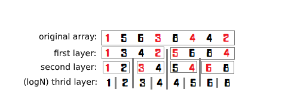

author: Xarfa

The dividing tree is a data structure to solve the largest $K$ interval, and its time complexity constant and the difficulty of understanding are much lower than the [persistent segment tree](../persistent-seg/#_1). At the same time, the dividing tree closely adheres to the "largest $K$ ", so it is a sort-based data structure.

 **It is recommended to finish learning [Persistent Segment Tree](../persistent-seg/#_1) and then look at the dividing tree**

## Tree construction

The construction of the dividing tree is relatively simple, but it is more complicated than other trees. 

As shown in the figure, each layer has a seemingly unordered array. In fact, every number marked in red is **to be assigned to the left child**. And the rules of distribution? It is compared with the median in this level, $\leq$ is on the left, otherwise it is on the right. But here we should pay attention: it is not strictly $\leq$ **left, otherwise right**. Because the median may be the same, and it has a certain relationship with the parity of $N$ . The following code would demonstrate a clever usage for your reference.
 
We cannot sort each layer every time, because the theoretical complexity would not pass, not to mention the constants. To find the median, one pass sorting is enough. Why? For example, if we find the median of $l,r$ , it is actually $num[mid]$ after sorting.

There are two key arrays:

```text
tree[log(N),N]   : That is, the tree needs to store all the values, space complexity is $O(n\log n)$ .
toleft[log(N),n] : That is, the number of left child entered in each layer 1~i. Here we need to understand that this is a prefix sum.
```

```pascal
procedure Build(left,right,deep:longint); // left and ight are intervals; deep is which layer we are currently on
var
  i,mid,same,ls,rs,flag:longint; // flag is used to balance the amount on the left and right
begin
  if left=right then exit; // reach the bottom layer
  mid:=(left+right) >> 1;
  same:=mid-left+1;
  for i:=left to right do 
    if tree[deep,i]<num[mid] then
      dec(same);

  ls:=left; // first pointer assigned to the left child
  rs:=mid+1; // first pointer assigned to the right child
  for i:=left to right do
  begin
    flag:=0;
    if (tree[deep,i]<num[mid])or((tree[deep,i]=num[mid])and(same>0)) then // condition to be assigned to the left
    begin
      flag:=1; tree[deep+1,ls]:=tree[deep,i]; inc(ls);
      if tree[deep,i]=num[mid] then // balance the number of left and right 
        dec(same);
    end
    else
    begin
      tree[deep+1,rs]:=tree[deep,i]; inc(rs);
    end;
    toleft[deep,i]:=toleft[deep,i-1]+flag;
  end;
  Build(left,mid,deep+1); // continue
  Build(mid+1,right,deep+1);
end;
```

## Querying

Let's first talk about the content of the persistent segment tree. When using the persistent segment tree to find the smallest $K$ in the interval, we use $K$ as the benchmark. If going to left, we go to left; if going to right, we must to subtract the value of the left. This is also the case in the dividing tree.

What makes the query difficult to understand is the **interval reduction**. In the figure below, we are querying from $3$ to $7$ , so we only need to query from $2$ to $3$ at the next level. Of course, we define $left,right$ as the reduced interval (target interval), and $l,r$ as the interval of the node. Then why should we mark the target interval? Because that's **the benchmark to determine whether the answer is on the left or on the right**.


```pascal
function Query(left,right,k,l,r,deep:longint):longint;
var
  mid,x,y,cnt,rx,ry:longint;
begin
  if left=right then // It doesn't hurt to write l=r, because the target interval must also have an answer
    exit(tree[deep,left]);
  mid:=(l+r) >> 1;
  x:=toleft[deep,left-1]-toleft[deep,l-1]; // number of left child from l to left
  y:=toleft[deep,right]-toleft[deep,l-1]; // number of left child from l to right
  ry:=right-l-y; rx:=left-l-x; // ry is the number of right child from l to right, and rx is the number of right child from l to left
  cnt:=y-x; // number of child node from left to right
  if cnt>=k then // typical persistent segment tree
    Query:=Query(l+x,l+y-1,k,l,mid,deep+1) // l+x is to reduce the left margin, l+y-1 is to reduce the right interval. For the above figure, it is to give up 1 and 2.
  else
    Query:=Query(mid+rx+1,mid+ry+1,k-cnt,mid+1,r,deep+1); // the same is to narrow the interval, but it becomes the right side. Pay attention to k-cnt.
end;
```

## Theoretical complexity and testing results

Time complexity: one query only needs $O(\log n)$ . For $m$ queries, it needs $O(m\log n)$ .

Space complexity: only need to store $O(n\log n)$ numbers.

Testing results: persistent segment tree: $1482 \text{ms}$ , dividing tree: $889 \text{ms}$. (Non-recursive, the constant is relatively small)

## Notes

You may also want to try implementing a [non-recursive version](https://blog.csdn.net/littlewhite520/article/details/70250722). (Original link in Chinese)