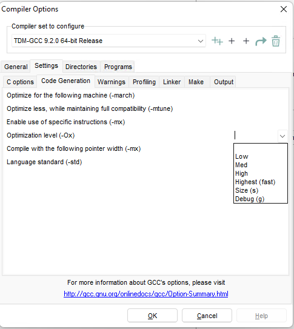
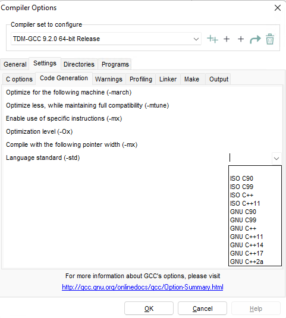
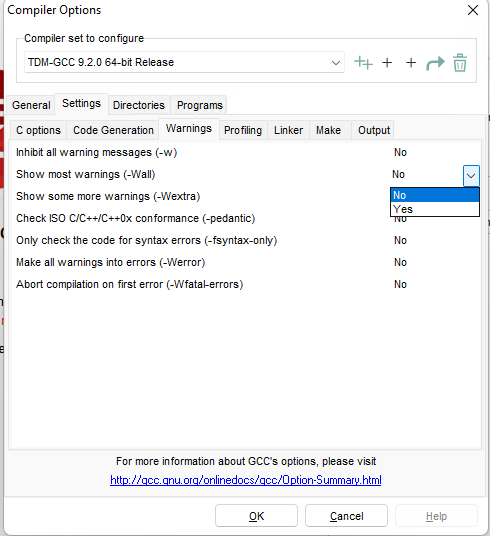
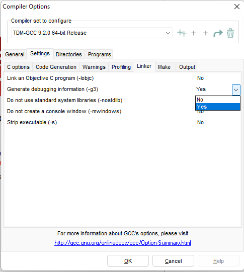
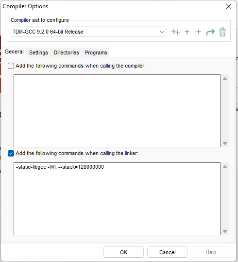
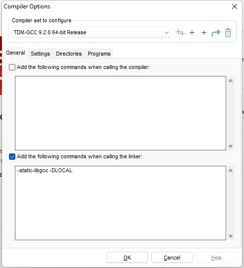
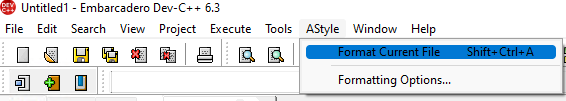
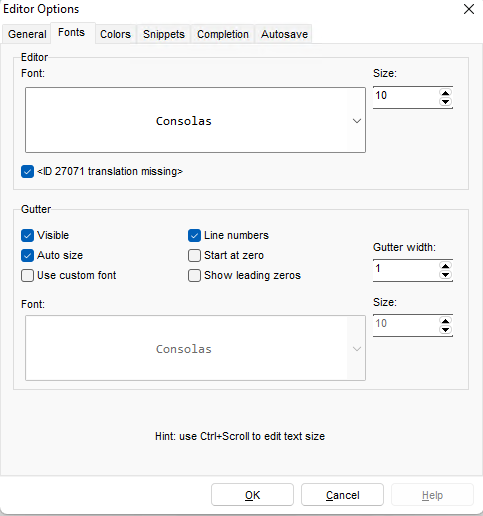
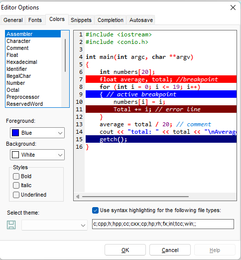

author: ksyx, ouuan, Doveqise, hsfzLZH1, wangqingshiyu, sshwy, NanoApe, DawnMagnet, CamberLoid

## Introduction

Dev-C++ is a free full-featured integrated development environment (IDE) distributed under the GNU General Public License for programming in C and C++(including C++11 and later). It is bundled with, and uses, the MinGW and GDB as its compiler and debugger. Dev-C++ runs in Microsoft Windows.

The advantage of Dev-C++ is friendly user interface, simple installation and support single file compilation. Therefore, it becomes the first choice of many beginner C++ learners and beginner competitors of competitive programming. For NOIP, in provinces which offer Windows as a standard operation system, it generally comes with pre-installed Dev-C++.

The origin of Dev-C++ is Bloodshed Dev-C++ written by Colin Laplace. Since February 22, 2005, the project was stopped updating. In 2006, lead developer Colin Laplace stated the situation that he was busy with real-life issues and did not have time to continue development of Dev-C++.

Orwell Dev-C++ is a variant of Bloodshed Dev-C++, developed and maintained by individual programmer Orwell (Johan Mes). The variant contains bug fixes and compiler updates. Generally speaking, all Dev-C++ 5.x are Orwell Dev-C++. This variant was last updated in 2015 with version 5.11.

Embarcadero Dev-C++[^ref1] is a successor of Bloodshed Dev-C++ and Orwell Dev-C++. In 2020, Embarcadero sponsored and continued the development of original Bloodshed Dev-C++. It contains support for high DPI, compiler updates and support new C++ standards, and dark mode.

The Dev-C++ distributions listed above are considered "official releases". Besides, after the stale development Orwell Dev-C++ in 2015, out of the need of teaching, an individual Chinese developer [royqh1979](https://github.com/royqh1979) decided to develop his personal fork of Dev-C++ named "Red Panda Dev-C++", integrating intelligent hint and updated version of MinGW64, which is convenient for personal use and studying. The project is hosted on [GitHub](https://github.com/royqh1979/Dev-Cpp).

## Getting Started to Use

### Frequently-used Shortcut Keys

#### File

- `Ctrl + N`: Create a source file.
- `Ctrl + O`: Open a source file.
- `Ctrl + W`: Close a source file.
- `Ctrl + P`: Print a source file.

#### Formatting

- `Ctrl + /`：Comment and uncomment.
- `Tab`: Insert indent.
- `Shift + Tab`: Undo indent.

#### Line Operation

- `Ctrl + E`: Copy selected line.
- `Ctrl + D`: Delete selected line.
- `Ctrl + Shift + Up`: Move cursor upward.
- `Ctrl + Shift + Down`: Move cursor downward.

#### Jumping

- `Ctrl + F`: Search
- `Ctrl + R`: Replace
- `F3`: Search next
- `Shift + F3`: Search previous
- `Ctrl + G`: Jump to line
- `Shift + Ctrl + G`: Jump to function
- `Ctrl +[1 ~ 9]`: Add bookmark(s)
- `Alt +[1 ~ 9]`: Jump to bookmark

#### Display

- `Ctrl + Mouse wheel`: Resize font
- `Ctrl + F11`: Toggle fullscreen 

#### Executing

- `F9`: Compile only
- `F10`: Execute only
- `F11`: Compile and execute
- `F12`: Re-compile all

#### Debugging

- `F2`: Jump to breakpoint
- `F4`: Set breakpoint or delete
- `F5`: Debugging execute
- `F6`: Stop
- `F7`: Debug step-by-step

### Process of Debugging

1. Switch compiler to `TDM-GCC (Version) 64-bit Debug`;
2. Press `F4` to set or cancel debugging breakpoint;
3. Put cursor to a variable and press `Alt + A` to add monitoring variables;
4. Press `F5` to start debugging;
5. Press `F7` or `Alt + N` to debug step-by-step;
6. Press `Alt + S` to jump to next debugging breakpoint;
7. Press `F6` to stop debugging.

## Advanced

### Add Compile Options

Click "Tools" -> "Compiler Options..." and select the "Settings" tab. Here introduces some options frequently used by the author:

#### Enable Optimization from Compiler

This option will optimize the time spent or space used by programs. 

Select the "Optimization Level (-Ox)" option in the "Code Generation" sub-tab, and choose the level you wan to use.



#### Choose Language Standard

This option enables using new language features in updated standards, or trying to compile code in older standard.

Select the "Language Standard (-std)" option in the "Code Generation" sub-tab, and choose the standard you wan to use.

 

#### Show All The Warnings

This option assists user to debug.

Toggle "Show most warnings (-Wall)" option in the "Warnings" sub-tab to enable the feature. 



#### Generate Debugging Informations

This option is needed when the user clicks "Debug" and the editor pops up a window "You have not enabled debugging info (-g) and/or stripped it from the executable (-s) in Compiler Options" and it crashed after the user clicked "Yes", or the user wants the debugging feature to be always-on.

Toggle "Generate debugging information (-g3)" option in "Linker" sub-tab to yes to enable it.



### Tricks of Compiling

Click "Tools" -> "Compiler Options...", and select the tab "General". Below is some frequently used tricks.

#### Extend the Stack

This may prevent stack overflow caused by too many recursions (like depth-first search).

Add `-Wl,--stack=128000000` to "Add the following commands when calling the linker".

The example above resized the stack to about 128MB, and can be adjusted as needed.



#### Define Marco

Macro is useful when testing locally with file I/O or other purposes.

Add `-D[string]` to "Add the following commands when calling the linker", where `[string]` is the macro needed to define.

In the following example, the parameter `-DLOCAL` make the following code to read from the file `test.in` and print to file `test.out`. <!---Which means, without the parameter the following code won't be compiled.-->



```cpp
#ifdef LOCAL
freopen("test.in", "r", stdin);
freopen("test.out", "w", stdout);
#endif
```

### Eye Candies

#### Code Formatting

To format the code, click "Astyle" -> "Format Current File" in toolbar or press <kbd>Ctrl</kbd>+<kbd>Shift</kbd>+<kbd>A</kbd>.



#### Fonts

To set fonts, click "Tools" -> "Editor Options..." and select "Fonts" tab. 



#### Color Scheme

To set color scheme, or theme, click "Tools" -> "Editor Options..." and select "Colors" tab. You can use the default theme, or adjust them yourself.



## References

[^ref1]: The project is hosted on [GitHub](https://github.com/Embarcadero/Dev-Cpp) and [SourceForge](https://sourceforge.net/projects/embarcadero-devcpp/).