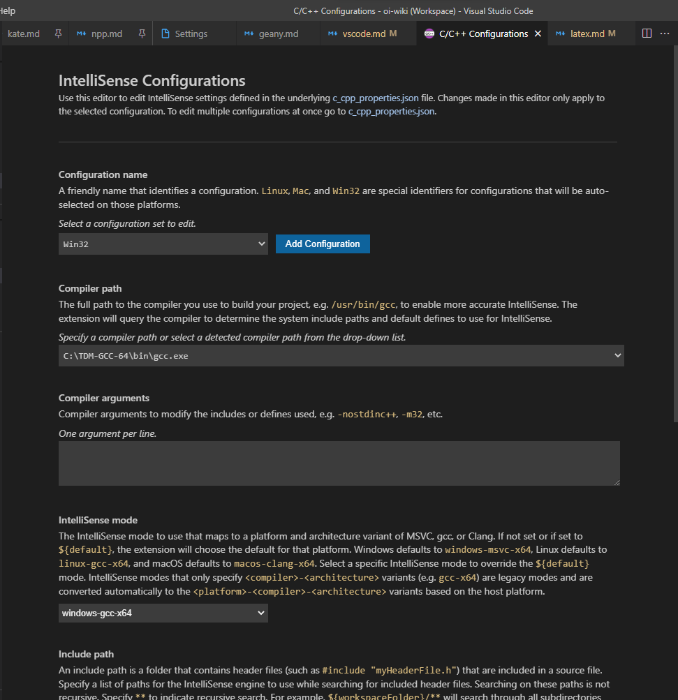
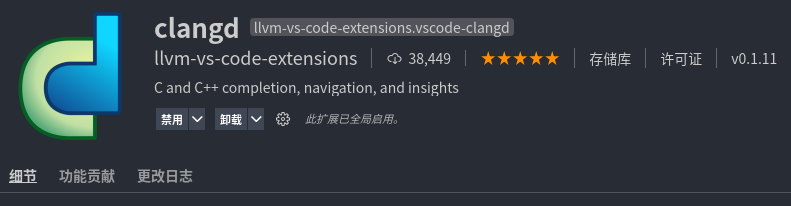

author: NachtgeistW, Ir1d, ouuan, Enter-tainer, Xeonacid, ChungZH, keepthethink, abc1763613206, partychicken, Chrogeek, xkww3n, 

Last translated on September 16th, 2021, with commit [353b1f6](https://github.com/OI-wiki/OI-wiki/commit/353b1f64c8a2c756695bb5e99f036d1e80819dbe)

## Introduction

Visual Studio Code, or VS Code, is an open-source code editor developed by Microsoft, supporting Windows, Linux and macOS. VS Code is written in TypeScript, and based on Electron framework. It bundled with built-in support for JavaScript, TypeScript and Node.js, and provides a rich ecosystem of extensions for other language like C, C++, Java, Python, PHP and Go.

Official site: [Visual Studio Code - Code Editing. Redefined](https://code.visualstudio.com/)

## Execute Code Using Code Runner

After installing and configuring extensions, VS Code will have support for C/C++. However the process is complicated. A simple solution to compile and run C++ programs is to install Code Runner extension.

Code Runner is an extension that allows one to run code in one click. In projects it is often used to verify code segments. It supports over 40 programming languages including Node.js, Python, C, C++, Java, PHP, Perl, Ruby and Go.

One way to install is to search Code Runner in extension marketplace and click Install; Another is go to [Marketplace](https://marketplace.visualstudio.com/items?itemName=formulahendry.code-runner) and click Install, then the browser will call VS Code automatically and start installation.


After finishing installation, open file to run, and click the little triangle icon at upper-right to run code. Pressing shortcut key <kbd>Ctrl</kbd>+<kbd>Alt</kbd>+<kbd>N</kbd>(or, for macOS, <kbd>Control</kbd>+<kbd>Option</kbd>+<kbd>N</kbd>) will do the same.

???+ warning
    If code is still unable to run after installing VS Code and Code Runner, it it probably because of the lack of C/C++ running environment in the operating system. For installation of environment please refer to [Hello, World!](../../lang/helloworld.md).

    Remember to toggle on Run In Terminal in preferences as in the following image: 

## Compile and Debug using C/C++ extensions

### Installation

Open extension store in VS Code, type `C++` or `@category:"programming languages"`, and find C/C++, and press Install to install it.


???+ warning
    Before continue to config, please make sure the that G++ or Clang has been installed, and has added them to `$PATH`. Please use CMD or Powershell instead of Git Bash.

### Configuring Compilation

First, open a folder in VS Code, and then press <kbd>F1</kbd>, type `C/C++: Edit configurations (UI)` and enter the configuration page of C/C++ extension.


Choose the path where G++ or Clang located in Compiler Path. Check again whether the path of compiler has been added to `PATH` environment variable if there is nothing to choose from.

### Configuring IntelliSense

This section is talking about adjusting smart auto-completion of VS Code.

If you are using Clang or G++ as compiler, remember to choose `clang-x64` (`gcc-x64` for G++) instead of default `msvc-x64` to enable features like auto-completion. Otherwise you will encounter an error saying "Intellisense mode msvc-x64 is incompatible with compiler path".



### Configure GDB/LLDB Debuggers

To enter debugging mode, create a new C++ file in VS Code and write something in C++ grammar, press <kbd>F5</kbd> after saving file. If a **choose environment** dialog pops up, select **C++ (GDB/LLDB)** and choose **g++ - Build and debug active file** for G++ users, or **clang++ - Build and debug active file** for Clang users.

???+ warning
    The configuration name is customizable. It may differ in different operating systems.

Then, VS Code will finish initialization automatically and open a `launch.json` configuration file. Ignore and close it.

At this point, all configuration processes have been completed. Press <kbd>F5</kbd> again and you will see debugging informations.

All files needed to be compiled and debugged are required to be saved in this folder in the future. If you need to compile and debug codes in other folders, you need to perform above steps again, or copy `.vscode` sub-folder in original folder to the new one.

### Debugging Code

To set a breakpoint on a certain line, open a code in VS Code, hover the cursor over the blank space to the left of the row number, and click the appeared red point. Re-click it will cancel the breakpoint.


Press <kbd>F5</kbd> to enter debug mode, where a debug toolbar will appear on the upper of editor. The four blue buttons represent `continue`, `next`, `step` and `until` in GDB from left to right.


In case that the editor did not jump automatically, you can enter debugging window by clicking `Run and Debug` in the left toolbar. Then the values of variables will appear.


In debugging mode, the code editor will display codes that will be executed next in yellow background.

## Configure clangd

???+ warning
    Because of conflict, IntelliSense from C/C++ extension will be automatically disabled after installing clangd extension, while some features like debugging still use C/C++ extension. If encountered problems of clangd's features, you may want to check whether IntelliSense from C/C++ is disabled.

### Introduction

From LLVM official site

> Clangd is an implementation of the Language Server Protocol leveraging Clang. Clangd’s goal is to provide language“smartness”features like code completion, find references, etc. for clients such as C/C++ Editors.

In short, clangd provides some smart features like project-wide indexing, cross-references, variable renaming, faster auto-completion, errors and warnings and formatting. Though is is officially described as an implementation of LSP protocol, its functions are rather more similar to a language server than a protocol itself.

VS Code's C/C++ extension also has features like auto-completion. However, comparing with clangd, it is inferior in accuracy of the legibility of the prompt information, etc. Therefore, we may sometimes use clangd instead of the C/C++ plugin to implement features such as code auto-completion.

### Installation

Linux users can use package manager to install clangd. Detailed operations are similar.

```bash
# Ubuntu/Debian
sudo apt install clangd 
```

For some distribution, it only requires clang as it is included.

```bash
# Arch/Manjaro
sudo pacman -S clang
```

MacOS users are required to install LLVM via Homebrew, as LLVM from built-in XcodeCommandLineTools doesn't include clangd. 

```bash
brew install llvm
```

Windows users can obtain binary installer from [LLVM Download Page](https://releases.llvm.org/download.html).

### VS Code Extension

Open VS Code extension market, type `clang` in search bar and install it.



Now, enjoy coding with features like auto-completion from clangd!
